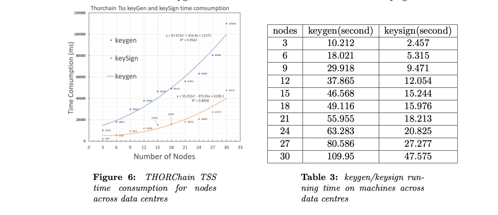
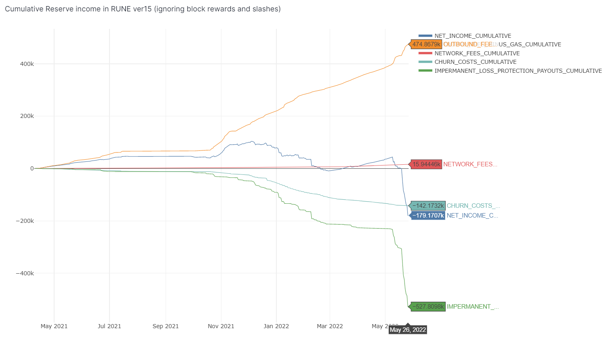

# ADR 002: REMOVE YGG VAULTS

## Changelog

- {date}: {changelog}

## Status

Accepted

## Context

There are two types of vaults in THORChain:

- cold, inbound vaults "asgard" using TSS
- hot, outbound vaults "yggdrasil" using 1of1

This is primarily a result of TSS limitations. During the initial build of THORChain it was found that TSS's quadratic scaling problem (signing times increase quadratically with the size of member committee) would set a limit on the number of outbounds per second.

Key extract from [TSS Benchmark 2020] (https://github.com/thorchain/Resources/blob/master/Whitepapers/THORChain-TSS-Benchmark-July2020.pdf)



Thus each node retains a 1of1 key to fast-sign outbounds. If they fail to sign, they are slashed and the tx re-delegated to an Asgard. THORChain with 100 nodes can do 100 outbounds a sec due to 100 ygg vaults. The vault funds are secured via economic security, but the following are outstanding (managed) problems:

1. Code complexity with ygg vaults have in past opened up exploit loopholes
2. Ygg vaults often go insolvent and lock node bonds
3. Increased vault-management costs (ygg funding)
4. Complexity in router upgrades requires logic to recall YggFunds

** Vault Costs **
Ygg funding is one of the larger expenses that increase THORChain's vault management costs:


However, 3 things have happened since:

1. Asgard Vault Sharding logic, introduced in Q2 2021, split asgards to allow scaling past 40 nodes
2. Synths, launched in Q1 2022, absorbed a significant part of arbitrage volume, reducing demand on L1 outbounds
3. `PoolDepthForYggFundingMin`, launched in Q1 2022, retained low-depth pools entirely in asgard vaults to prevent significant splitting of funds

As a result, the system has shown stability and reliability with multiple Asgards (and some pools are entirely asgard-managed), and L1 outbounds have reduced.
Thus an opportunity presents itself to remove YggVaults entirely and rely only on Asgards, with no code change required. To do this

1. `STOPFUNDYGGDRASIL = 1` to stop yggs being funded (node churns will slowly empty yggs back to Asgard)
2. `AsgardSize = 20` to reduce asgard size down to 20

Formula to compare new Asgard performance:

```text
throughputMultiplier  = (oldSize^2 / newSize^2) * (oldSize / newSize)
```

Comparing with 15 seconds per TSS key-sign for 27 nodes (observed performance):

- 40: 1x at 3 vaults, 0.3tx/sec
- 20: 8x at 6 vaults, 2tx/sec
- 16: 15x at 7 vaults, 3tx/sec
- 14: 23x at 8 vaults, 5tx/sec
- 12: 37x at 9 vaults, 7tx/sec
- 9: 87x at 12 vaults, 17tx/sec
- 6: 296x at 18 vaults, 60tx/sec
- 3: 2370x at 35 vaults, 474tx/sec <- thought bubble: is there a reason to _not_ do this?

Note1: increasing the count of asgard does not change the economic security of the funds (funds always 100% secured), nor does it change bandwidth requirements, since the same observations are required. The _only_ consideration is fund-splitting. Ie, if someone could demand 10% of the funds of a pool, then TC should be able to fulfil in one tx, (not two from two vaults). So this puts the "limit" at 10 vaults (each with 10% of the funds). But likely users will only demand 2% of the funds of most pools, most of the time. (2% swap is a big swap, and there are only 7/4215 BTC LPs with more than 2% LP). So 50 vaults is "ok", which means `AsgardSize = 3` is theoretically ok to attempt.

Note2: the network currently signs at 0.14tx/sec (so `AsgardSize = 40` can tolerate current useage, thus `AsgardSize = 20` can tolerate an 8x increase in L1 demand).

Note3: Although the network can currently sign at 100tx/sec (100 ygg vaults), it's never been required. Wherever there is a huge gap in performance required vs performance available, almost always compromises can be reclaimed. Here it is complexity and vaulting costs.

## Decision

Pros:

- Removal of complex Ygg Vault logic (the simpler the code, the easier to learn, maintain and reduce attack vectors)
- Cheaper vaulting costs
- Removal of ygg insolvencies
- THORNodes are now 100% non-custodial (no 1of1 keys), means pooledNodes can be encouraged and lightNodes can be explored again

Cons:

- Reduction in L1 output (100 tx/sec down to 2tx/sec)

1. Put out for a temperature check
2. If well-received, then go via `admin-mimir` (not `node-mimir` because this is a network-security optimisation, and it may need to be quickly rolled back in case issues)

admin-mimir

1. `STOPFUNDYGGDRASIL = 1` to stop yggs being funded (node churns will slowly empty yggs back to Asgard)
2. `AsgardSize = 20` to reduce asgard size down to 20

## Consequences

This will retain ygg-code, but effectively disable the feature. Throughput will decrease, but more than enough (8x margin) with current demand levels.

If issues are observed:

1. Roll back to ygg-vaults
2. Double-down and reduce asgardSize even further

### Positive

### Negative

### Neutral

## References

- https://github.com/thorchain/Resources/blob/master/Whitepapers/THORChain-TSS-Benchmark-July2020.pdf
- https://app.flipsidecrypto.com/dashboard/2022-05-29-network-fees-versus-churn-costs-comparison-b0ynW-
