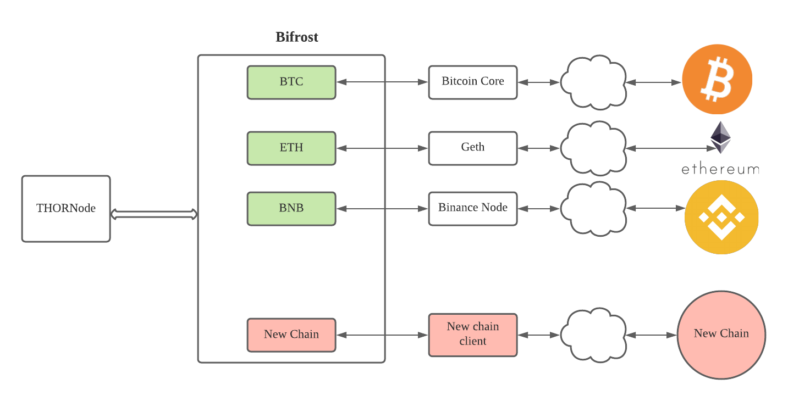

# How to add a new chain

On a high level, this is how THORChain interact with external chains



For those chains that using cosmos sdk, and has IBC enabled, should be able to integrate with THORChain using IBC, at the moment, IBC is not enabled on THORChain yet.

In order to add a new chain to THORChain, there are a few changes you will need to make.

- Thornode changes
- Bifrost changes
- Node launcher changes
- Smoke test changes ([heimdall](https://gitlab.com/thorchain/heimdall))
- xchainjs changes

Note: At the moment, THORChain only support ECDSA keys, ED25519 will be supported in the near future, you can keep track the progress from [here](https://gitlab.com/thorchain/thornode/-/issues/972)

## Thornode changes

There are some changes need to be made in Thornode, detail as following

| file                                         | func                                                                       | logic                                                                                                                  |
| -------------------------------------------- | -------------------------------------------------------------------------- | ---------------------------------------------------------------------------------------------------------------------- |
| common/address.go                            | func NewAddress(address string) (Address, error)                           | Add logic to parse an address                                                                                          |
| common/chain.go                              | func (c Chain) GetGasAsset() Asset                                         | Return gas asset for the chain                                                                                         |
| common/chain.go                              | define a chain variable at the top                                         | like https://gitlab.com/thorchain/thornode/-/blob/develop/common/chain.go#L22                                          |
| common/gas.go                                | func UpdateGasPrice(tx Tx, asset Asset, units []cosmos.Uint) []cosmos.Uint | add logic in regards to how to update gas                                                                              |
| common/asset.go                              | define an asset                                                            | like https://gitlab.com/thorchain/thornode/-/blob/develop/common/asset.go#L22                                          |
| common/pubkey.go                             | func (pubKey PubKey) GetAddress(chain Chain) (Address, error)              | add logic to get address from a pubic key                                                                              |
| build/docker/components/newchain.yml         |                                                                            | docker composer file to run the chain client , run it in regtest mode , so as the client will be used for mocknet test |
| build/docker/components/validator.yml        |                                                                            | Update the files according to run chain client in docker composer, used it for test purpose                            |
| build/docker/components/validator.linux.yml  |                                                                            |                                                                                                                        |
| build/docker/components/standalone.base.yml  |                                                                            |                                                                                                                        |
| build/docker/components/standalone.linux.yml |                                                                            |                                                                                                                        |

## Node launcher changes

Node launcher is the repository used to launch thorchain node, [https://gitlab.com/thorchain/devops/node-launcher.git](https://gitlab.com/thorchain/devops/node-launcher.git)

1. Create a new folder under the root folder, like "newchain-daemon"
2. Add new helm chart to run the chain client daemon
3. Make sure the autoscaling capabilities are still enough on the max nodes configuration.

## Bifrost changes

Bifrost is a key component in THORChain, it is a bridge between THORChain and external chains

1. First, create a new folder under bifrost\pkg\chainclients
1. Implement interface `ChainClient` interface, refer to [here](../bifrost/pkg/chainclients/chainclient.go)

```go
// ChainClient is the interface that wraps basic chain client methods
//
// SignTx       signs transactions
// BroadcastTx  broadcast transactions on the chain associated with the client
// GetChain     get chain
// GetHeight    get chain height
// GetAddress   gets address for public key pool in chain
// GetAccount   gets account from thorclient in cain
// GetConfig	gets the chain configuration
// GetConfirmationCount given a tx in , return the number of blocks it need to wait for confirmation
// ConfirmationCountRead given a tx in , return true/false to indicate whether the tx in is ready to be confirmed
// IsBlockScannerHealthy return true means the blockscanner is healthy ,false otherwise
// Start
// Stop
type ChainClient interface {
	SignTx(tx stypes.TxOutItem, height int64) ([]byte, error)
	BroadcastTx(_ stypes.TxOutItem, _ []byte) (string, error)
	GetHeight() (int64, error)
	GetAddress(poolPubKey common.PubKey) string
	GetAccount(poolPubKey common.PubKey) (common.Account, error)
	GetAccountByAddress(address string) (common.Account, error)
	GetChain() common.Chain
	Start(globalTxsQueue chan stypes.TxIn, globalErrataQueue chan stypes.ErrataBlock)
	GetConfig() config.ChainConfiguration
	GetConfirmationCount(txIn stypes.TxIn) int64
	ConfirmationCountReady(txIn stypes.TxIn) bool
	IsBlockScannerHealthy() bool
	Stop()
}
```

1. implement interface [BlockScannerFetcher](../bifrost/blockscanner/blockscanner.go) in the chain client you implement

```go

// BlockScannerFetcher define the methods a block scanner need to implement
type BlockScannerFetcher interface {
    // FetchMemPool scan the mempool
    FetchMemPool(height int64) (types.TxIn, error)
    // FetchTxs scan block with the given height
    FetchTxs(height int64) (types.TxIn, error)
    // GetHeight return current block height
    GetHeight() (int64, error)
}

```

1. update bifrost/pkg/chainclients/loadchains.go to initialise new chain client

This is a sample PR to add bitcoin cash support, in thornode & bifrost

[https://gitlab.com/thorchain/thornode/-/merge_requests/1395](https://gitlab.com/thorchain/thornode/-/merge_requests/1395)
